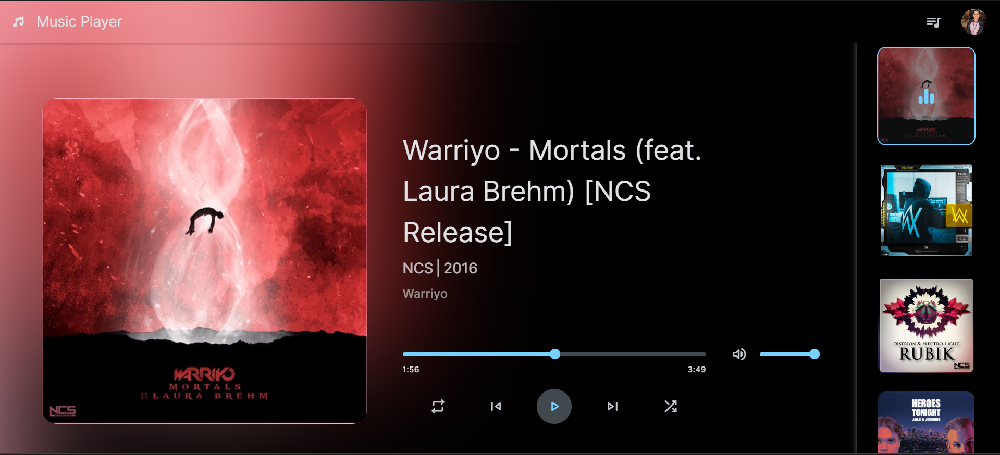

# Music Player 🎵

A dynamic and interactive Music Player application developed as part of the CodeAlpha web development internship. This project showcases skills in HTML, CSS, and JavaScript, creating a seamless user experience for managing and playing music.

## Features ✨

- **Dynamic Playlist Management:** Users can view and manage a playlist of NCS tracks.
- **Interactive UI:** Sleek design that adapts to all screen sizes, providing an optimal user experience.
- **Enhanced Audio Controls:** Includes functionalities for play, pause, skip, shuffle, and repeat.
- **Volume Control:** Easily adjust the volume or mute the music.
- **Real-Time Updates:** The music player updates track details and UI elements dynamically.

## Technologies Used 🛠️

- **HTML & CSS:** For structuring and styling the application.
- **JavaScript:** To add interactivity and handle music player functionalities.
- **Font Awesome:** For incorporating visually appealing icons.
- **Google Fonts:** For custom typography.

## Screenshots 📸



## Demo 🚀

Check out the live demo [here](https://kav-music-player.vercel.app/).

## Installation 📦

1. **Clone the repository:**
   ```bash
   git clone https://github.com/kavyaballa1020/codealpha-music-player.git
   ```

2. **Navigate to the project directory:**
   ```bash
   cd music-player
   ```

3. **Open `index.html` in your browser:**
   ```bash
   open index.html
   ```
   or
   ```bash
   start index.html
   ```

## Usage 🖥️

1. **Play Music:** Click the play button to start playing the selected track.
2. **Navigate Tracks:** Use the previous and next buttons to skip tracks.
3. **Shuffle and Repeat:** Toggle shuffle and repeat functionalities using the respective buttons.
4. **Volume Control:** Adjust the volume using the volume slider or mute the audio.

## Project Structure 📁

- **index.html:** Main HTML file.
- **assets/**
  - **css/**
    - `style.css`: Stylesheet for the application.
  - **images/**: Folder containing images and icons.
  - **js/**: Folder containing JavaScript files.
- **README.md:** Project documentation.

## Contributing 🤝

Contributions are welcome! Please follow these steps to contribute:

1. Fork the repository.
2. Create a new branch (`git checkout -b feature-branch`).
3. Make your changes.
4. Commit your changes (`git commit -m 'Add some feature'`).
5. Push to the branch (`git push origin feature-branch`).
6. Open a pull request.

## License 📄

This project is licensed under the MIT License - see the [LICENSE](LICENSE) file for details.

## Acknowledgements 🙏

- **CodeAlpha:** For the amazing internship opportunity.
- **Font Awesome:** For the icons.
- **Google Fonts:** For the typography.
- **NCS:** For the music tracks used in the demo.
